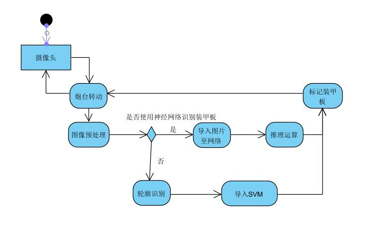

# 算法组线上评审

## 算法框图

## 算法原理介绍及关键公式推导

### 1. 装甲板检测

- 通过图像处理获得可能的装甲板灯条的轮廓。
- 通过大小、形状、倾斜度和其他条件初步过滤出可能的装甲板灯条。
- 按照上述条件进行排序，两两相匹并进行计算。最终确定装甲板的大小与位置。

### 2. 识别装甲板

- 对于传统识别，使用SVM 网络来实现对装甲板进行分类，标记数字，识别敌我。
- 使用改编自yolov5的神经网络，装甲板检测和数字识别一并进行，网络输出即为装甲板四点位置和标号。

### 3. 追踪器

使用 KCF 跟踪器，它是一种内核相关的滤波器算法。基于核化的 岭回归分类器 使用循环移位得到的 循环矩阵 来采集正负样本，利用循环矩阵在 傅里叶空间 可对角化的性质，将矩阵的运算转化为元素的点乘，从而降低了运算量，使得算法满足实时性要求。同时， KCF使用 多通道HOG特征 代替单通道灰度特征，将特征扩展到多通道的非线性特征空间，达到了更高的鲁棒性和准确性。

### 4. 实际效果演示

